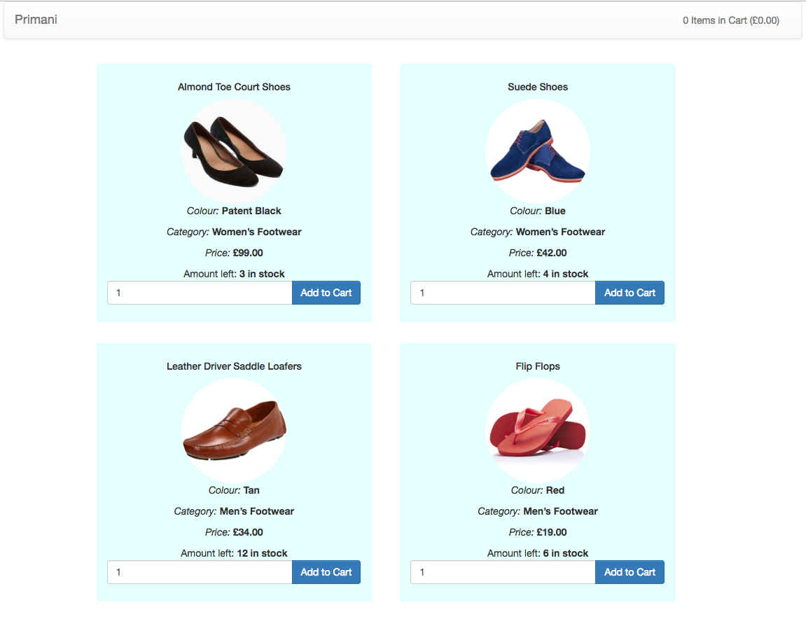
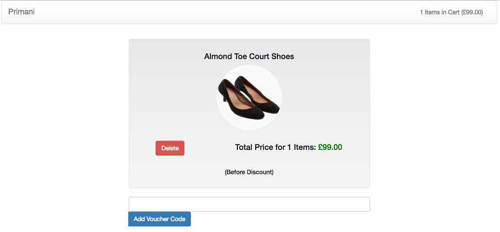
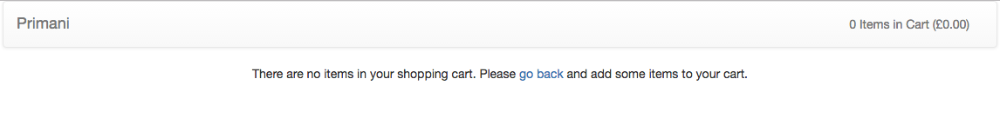
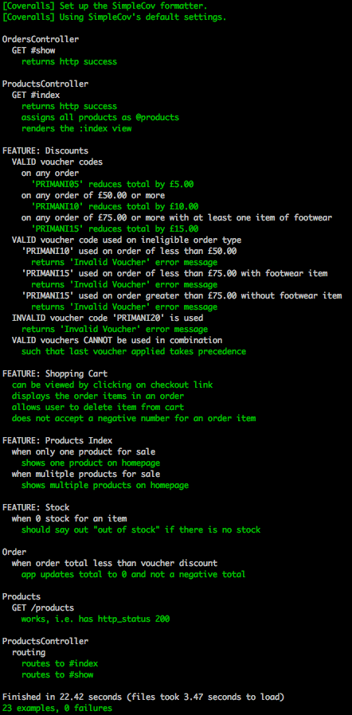

 
# PRIMANI

[Features](#features) | [Installation](#installation) | [Usage](#usage) | [Technologies](#technologies) | [Tests](#tests) | [Approach](#approach)

A basic but responsive website with shopping cart for a fictional clothing retailer.  The website displays all of the available products (plus their colour, category, price and available stock), as well as a shopping cart to which items can be added, removed, totalled and discounted using voucher codes.  

Please see the below screenshots to understand the look and feel of the final product:

#### Homepage

  

#### Shopping Cart

###### With items

  

###### Without items

  

## <a name="features">Features

The website delivers the following features for the below fictional user stories:

- [X] As a User I can view the products, their category, price and availability information.

- [X] As a User I can add a product to my shopping cart.

- [X] As a User I can remove a product from my shopping cart.

- [X] As a User I can view the total price for the products in my shopping cart.

- [X] As a User I can apply a voucher to my shopping cart.

- [X] As a User I can view the total price for the products in my shopping cart with discounts applied.

- [X] As a User I am alerted when I apply an invalid voucher to my shopping cart.

- [X] As a User I am unable to add Out of Stock products to the shopping cart.

## <a name="installation">Installation

1. Open the directory on your computer where you wish to install this project.

2. From that directory, clone this repo by running ``git clone git@github.com:awye765/shop.git`` from the command line.

3. Run ``bundle install`` from the command line to install all gems and dependencies necessary to run the project.

4. Run ``rake db:create`` to create the test and development databases.

5. Run ``rake db:migrate`` to complete the database migrations for those databases.

6. Run ``rake db:seed`` to seed the databases with the mock data for the shop.

7. Run ``rails s`` from the command line.

8. Open your preferred browser and navigate to the following address: ``http://localhost:3000/``.

9. The project should be running in your browser for you to explore and use.

To run the tests, please see the [below](#tests) section on testing.

## <a name="tests">Tests

After completing the  [above](#installation) installation instructions, run  ``rspec`` from the command line.  

<strong>Note the tests use Selenium browser automation to run tests. To ensure these work please ensure you have downloaded the latest version of Firefox (the default browser for these tests), by downloading and installing Firefox [here](https://www.mozilla.org/en-GB/firefox/new/?utm_source=google&utm_medium=paidsearch&utm_campaign=Firefox-Brand-UK-EN-GGL-Exact&utm_term=firefox&gclid=CPbEzvm_7M4CFYYV0wodSAcCRg).</strong>

This app has 100% test coverage using a combination of unit and feature tests.

  

Please note this will take approximately 30-60 seconds to run.  

## <a name="technologies">Technologies

#### Backend
- Ruby
- Ruby on Rails
- PostgreSQL

#### Frontend
- HTML5 & CSS3
- Bootstrap CSS & JS
- JavaScript
- Paperclip

#### Testing
- RSpec
- Capybara
- FactoryGirl

#### Test Analytics
- Coveralls
- Travis CI

## <a name="approach">Approach

### Design

I've kept design to a minimum, reserving design decisions for the client.  I have however adopted a simple responsive grid layout typical for fashion retailers based on my research of leading fashion retailers.  To give a sense of the finished product I've included stock images, particularly as clothing/fashion is a highly visual product.

### Structure

The architecture is a standard Rails MVC structure backed by a PostgreSQL database used to store mock data regarding products, orders and order items.

#### Models

The app has <strong>three</strong> models:

* A products model - manages the data for each product (id, name, colour, category, price, stock) and the methods for updating these attributes.  Each product has many order items a product.

* An orders model - manages the data for each order, i.e. both the total quantity and subtotal for each individual item added to a user's order (or shopping cart) together with the over total items and total price for all order items in the order.  Each order has many order items

* An order items model - manages the data for each order item, i.e. the quantity and subtotal for each product added to an order.  Each order item belongs to (a) an order and (b) an order item.

#### Controllers

The controllers for the products, orders and order items have been kept as slim as possible, extracting the business logic to the associated models and helper modules.

#### Views

Wherever possible I've used partials to separate the building blocks of each view into manageable chunks, especially where the view is rendering a repeated template with product/order specific information, e.g. each product displayed on the index page and each order item displayed in the shopping cart.

##### OOP / OOD

I've tried to implement the single responsibility principle in my code so it is less coupled, more easily maintained and less brittle.  Likewise I've adopted a separation of concerns by using the MVC architecture.

### Technologies

I used Ruby and Ruby on Rails coupled with a PostgreSQL database to store product data.  JavaScript and AJAX perform the dynamic updating of content, for instance the increasing of items in the cart display in the top right corner and the decreasing of available stock in the product listing on the index page.  I chose Rails as it allowed me to rapidly prototype, test and deliver the MVP.  I felt this would aid an AGILE/continuous delivery of the MVP to the client so that we can begin iterating and improving it to their needs as quickly and efficiently as possible.

### Validations

I've added validations so that a user <strong>cannot</strong>:

* Cannot add 0 quantity of an item to the cart, instead they can only add a minimum of 1 item to the cart.

* Cannot add a quantity of a particular item greater than the total stock for that item.

* Cannot add out of stock items to their cart - out of stock items are listed as "Out of Stock" as soon as they become sold out.  For instance, if 5 items are in stock when a user lands on the homepage and they order 5 the item's listing will immediately change to "Out of Stock" as they have intended to purchase the entire stock available at that time.

### Vouches/discounts

I've created three voucher codes:
* PRIMANI05
* PRIMANI10
* PRIMANI15

PRIMANI05 applies a £5.00 discount for any type of order.  PRIMANI10 applies a £10.00 discount <strong>provided that</strong> the total value of cart items is greater than £50.00.  PRIMANI15 applies a £15.00 discount <strong>provided that</strong> the total value of cart items is greater than £75.00 <strong>and</strong> contains at least one if of footwear.

After some research online of leading clothes retailers I found that if multiple voucher codes are applied the default result is to discount the last voucher code applied to a cart rather than combine them together.  As such, I've assumed vouchers cannot be combined and, if they are, the total value of the cart is discounted by the last voucher code applied to the cart.  I would want to check this assumption with the client and confirm their intentions in this regard and update code accordingly if necessary to give effect to their intentions.

I have also ensured that a user is not charged a negative amount of money.  For instance, if an item is in future less than £5.00 (e.g. £1.99) it might be possible to apply PRIMANI05 and result in a negative total for a cart.  To avoid this, any such order/voucher combinations otherwise resulting in a negative total for a cart default to 0.

### Client Input

I would seek the following client input to clarify whether the following features might be helpful to their product:

* Ability to update the quantity from the shopping cart page, e.g. an "update quantity" button allowing users to increase/decrease the number of items in their cart at the cart page rather than having to delete all items and return to the products index page to adjust their order up or down.  I assumed this might be intended by the client but the user stories only specify adding and removing a singular product from the cart so this is something I would wish to clarify with the client before extending the codebase.

* Treatment of discounts as discussed above, in particular how combinations of discounts should be treated.

* How they would like to integrate a payment system into the existing MVP so that users can complete an order by supplying payment details and settling their bill for cart items, for instance using [Stripe](https://stripe.com/gb).

* Whether they would want user authentication so that only users with an account for the site can purchase items once logged in.  I would prototype that functionality using [Devise](https://github.com/plataformatec/devise), possibly with any API logins (e.g. [omniauth](https://github.com/omniauth/omniauth) login with Facebook or Twitter etc) that the client may be interested in using.

* Whether they would want an email/SMS system to confirm to customers their order details (e.g. using [Pony](https://github.com/benprew/pony).

* Special offers - I noticed in the fictional specification that "Fine Stripe Short Sleeve Shirt, Green" has a price of £49.99 listed but struckthrough and a lower price of £39.99 stipulated.  I'd want to clarify with the client whether they need functionality allowing for the display of list prices and special offer prices for each product.  If so, updates would need to be made to the model and database to accommodate that functionality.
